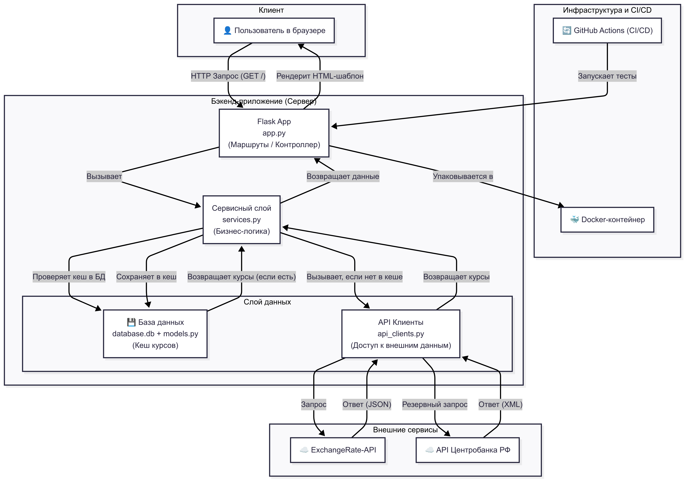

# ZOND — Сервис курсов валют

**ZOND** — это веб-сервис, который предоставляет надежный доступ к курсам валют. Приложение спроектировано с упором на отказоустойчивость, скорость и воспроизводимость: оно автоматически переключается между источниками данных, кеширует результаты и полностью упаковано в Docker-контейнер, что гарантирует идентичный запуск и работу на любой машине.


## GitHub
https://github.com/Diglander/ZOND
## Веб-Приложение
https://diglander.pythonanywhere.com/

## Ключевые особенности

**Отказоустойчивость:** Автоматическое переключение на резервный API (Центрального Банка РФ) при недоступности основного (ExchangeRate-API).

**Принудительное обновление:** Пользователи могут вручную инициировать обновление курсов с любого из двух API прямо через веб-интерфейс.

**Кеширование в БД:** Актуальные курсы на текущий день сохраняются в локальную базу данных (SQLite), что минимизирует запросы к внешним сервисам и значительно ускоряет загрузку.

**Контейнеризация (Docker):** Проект полностью готов к работе в любой среде. Запуск одной командой без необходимости ручной настройки окружения.

**Чистая архитектура:** Логика разделена на слои: контроллеры (app.py), сервисы (services.py), клиенты API (api_clients.py) и модели данных (models.py).

**Автоматическое тестирование:** Качество и надежность кода подтверждены модульными тестами.

**Внешний деплой:** Проект развернут на внешнем сервере и доступен для демонстрации.

## Стек технологий

**Бэкенд:** Python, Flask, SQLAlchemy

**Окружение и Деплой:** Docker

**База данных:** SQLite

**Тестирование:** Pytest, pytest-mock

**Инструменты:** Loguru, python-dotenv

# Установка и запуск

## Запуск с Docker (Рекомендуемый способ)
### 1. Клонируйте репозиторий

```bash
git clone https://github.com/Diglander/ZOND.git
cd ZOND
```

### 2. Настройте переменные окружения

**Создайте файл .env в корневой папке проекта и добавьте в него ваши API-ключи:**

```Ini
API_KEY_env="ВАШ_КЛЮЧ_ОТ_EXCHANGERATE-API"
CB_API_env="https://www.cbr.ru/scripts/XML_daily.asp"
```

### 3. Соберите Docker-образ

Эта команда прочитает Dockerfile и создаст готовый к запуску "слепок" вашего приложения.

```bash
docker build -t zond-app .
```

### 4. Запустите контейнер

Команда запустит приложение, используя ваш .env файл, и сделает его доступным на порту 5000.

**Откройте http://localhost:5000 в вашем браузере**

## Локальная установка (Без Docker)

```bash
docker run -p 5000:5000 --env-file .env -d zond-app
```

### 1. Клонируйте репозиторий

```bash
git clone https://github.com/Diglander/ZOND.git
cd ZOND
```

### 2. Создайте и активируйте виртуальное окружение

**macOS/Linux:**
```bash
python3 -m venv .venv
source .venv/bin/activate
```

**Windows:**
```bash
python -m venv .venv
.venv\Scripts\activate
```

### 3. Установите зависимости

```bash
pip install -r requirements.txt
```

### 4. Настройте переменные окружения

Создайте файл `.env` в корневой папке проекта и добавьте в него ваши API-ключи:

```ini
API_KEY_env="ВАШ_КЛЮЧ_ОТ_EXCHANGERATE-API"
CB_API_env="https://www.cbr.ru/scripts/XML_daily.asp"
```

### 5. Запустите приложение

```bash
flask run
```

База данных `database.db` будет создана автоматически при первом запуске. Откройте **http://127.0.0.1:5000** в вашем браузере.

## Тестирование

Проект покрыт модульными тестами для проверки корректности парсинга ответов от внешних API.

Для запуска тестов выполните команду:

```bash
pytest

```
